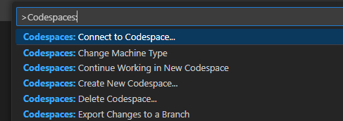
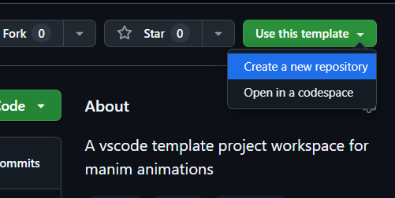
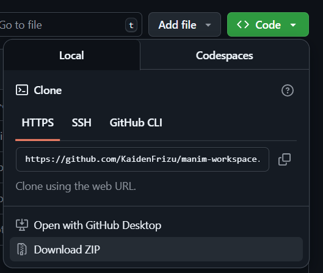

# Manim Workspace Template

<a href="https://codespaces.new/KaidenFrizu/manim-workspace?quickstart=1"></a>
<a href="https://pypi.org/project/manim/"></a>
<a href="https://github.com/ManimCommunity/manim"></a>

For `manim` animators who doesn't want to install package managers and dependencies (e.g. FFmpeg, LaTeX) in their local machine to have a working `manim` environment.

This workspace utilizes Dev Containers that handle `manim` installation, dependencies, and updates. The container uses `manim` [Docker image](https://hub.docker.com/r/manimcommunity/manim/tags).

With this template, you only need to install [VS Code](https://code.visualstudio.com/download) and [Docker](https://www.docker.com/get-started/) (if working locally) to use `manim`

This Dev Container also comes with FFmpeg and LaTeX for rendering Math text and [Manim Sideview](https://github.com/Rickaym/manim-sideview) VS Code Extension. For details on using the extension, visit the [extension page](https://marketplace.visualstudio.com/items?itemName=Rickaym.manim-sideview).

You can also use this container to run manim on JupyterLab. For details, see [Using the Workspace - Jupyter Lab](#jupyter-lab)


<a href="https://github.com/KaidenFrizu/manim-workspace/discussions"></a>
<a href="https://github.com/KaidenFrizu/manim-workspace/issues"></a>


---

## Setup :gear:
### GitHub Codespaces
If you want to immediately start working on a project on a cloud environment using only your installed VS Code, try going through these steps below.

> [!IMPORTANT]
> If you're opening Codespaces through [Visual Studio Code](https://code.visualstudio.com/download) in your computer, you must have [GitHub Codespaces](https://marketplace.visualstudio.com/items?itemName=GitHub.codespaces) extension installed

1. Click the link below:

   [](https://codespaces.new/KaidenFrizu/manim-workspace?quickstart=1)

2. Create a `manim` [Scene](src/example_scene.py), and enjoy working on your environment

> [!NOTE]
> Using Codespaces would consume Codespace Credits on your accounts. To learn more about Codespaces, visit [What are GitHub Codespaces - Billing for Codespaces](https://docs.github.com/en/codespaces/about-codespaces/what-are-codespaces#billing-for-codespaces)

> [!TIP]
> To re-open your existing codespace when you launch VS Code again, open a Command Palette (`F1` / `Ctrl + Shift + P` / `Cmd + Shift + P`), search for `Codespaces: Connect to Codespace...`, and select your existing codespace
> 
> 

### Dev Containers

If you wanted to work on a project locally without consuming credits, you can go through these steps to have an isolated local environment.

> [!IMPORTANT]
> You must have [Docker](https://www.docker.com/get-started/) and [Visual Studio Code](https://code.visualstudio.com/download) with [Dev Containers](https://marketplace.visualstudio.com/items?itemName=ms-vscode-remote.remote-containers) extension installed

1. Create your own repository from this template.

   

2. Clone or Download your created repository.

   ```
   git clone https://github.com/{YOUR_GH_USERNAME}/{YOUR_REPO_NAME}.git
   ```

   

3. In VS Code, Open the Command Palette (`F1` / `Ctrl + Shift + P` / `Cmd + Shift + P`)
4. Search and select `Dev Containers: Open Folder in Container...`

   

5. Select the folder that was cloned or downloaded to your computer.
6. When the setup if finished, create a `manim` [Scene](src/example_scene.py) and enjoy working on your environment.

> [!NOTE]
> If you've downloaded the repository, make sure to extract the contents in your `.zip` file before opening in the container.

> [!TIP]
> To re-open the container when you launch VS Code again, follow Steps 3-6

---

## Using the Container :desktop_computer:
You can use one (or both) methods to create and render animations in `manim`, depending on your preference.

### Manim Sideview

1. Open up a [Scene](src/example_scene.py) in your Dev Container Environment.
2. Open the Command Palette (`F1` / `Ctrl + Shift + P` / `Cmd + Shift + P`) and look for *"Manim: Render a New Scene"*
3. Select the scene from your current file that you wanted to render.
4. The output file would be autoplayed on the right side of your VS Code window.

   

> [!TIP]
> You can modify your settings in VS Code to automatically render the current scene on saving the `.py` file.
> 

> [!TIP]
> For more details on how to use Manim Sideview, visit [Manim Sideview repository](https://github.com/Rickaym/Manim-Sideview)

### Jupyter Lab

1. In your Dev Container environment, open a terminal (`` Ctrl + ` ``).
2. Run the command `jupyter lab`.
3. Open one of the `http://` URLs given in the terminal to your browser.

   

4. From the Jupyter Lab environment, create a [notebook](src/example_notebook.ipynb) and enjoy creating animations from here.

   

> [!TIP]
> To shutdown your current Jupyter Lab server, press `Ctrl + C` on the same terminal, or go to `File -> Shut Down` in Jupyter Lab window. To view currently running servers, run `jupyter server list` on a terminal.

> [!TIP]
> For more examples using `manim` on notebooks, visit:
> https://github.com/ManimCommunity/jupyter_examples
